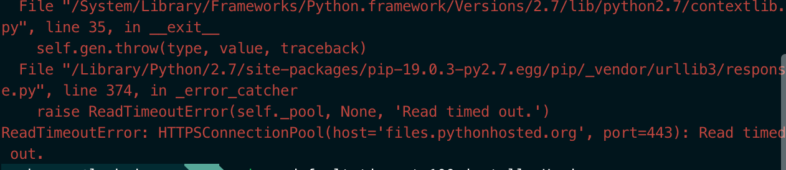
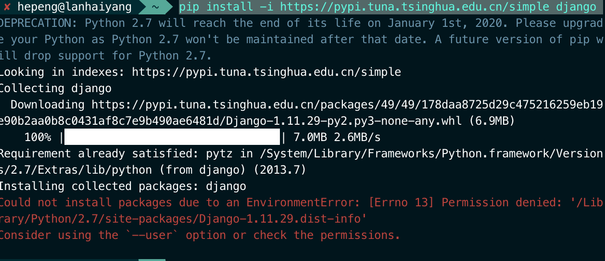

## 通过pip 安装遇到的问题

> sudo pip install django

> pip --default-timeout=100 install -U django
> 但函数出现上面的问题
> 通过延迟操作，适用于小库的按照

## 修改源

> pip install -i https://pypi.tuna.tsinghua.edu.cn/simple django
> 
> 
> 下载得很快，但是还是报错

## 使用 --user

> pip install -i https://pypi.tuna.tsinghua.edu.cn/simple django --user
> 
> 终于安装成功了
> 

## 加密库

> pip install pycryptodome
> import Crypto